# 🏗 ポリグロット・アーキテクチャ・ガイド

本プロジェクトでは、Python と JavaScript という異なる言語で書かれたエージェントを、あたかも同じ言語で書かれているかのように透過的に扱う仕組み(ポリグロット構成)を導入しています。

このドキュメントでは、その仕組みの裏側を、図解を交えて詳しく解説します。

既存システムで異なる言語での拡張をサポートしたい、あるいは異なる言語間の連携にトライしたい皆さんにとって、有用な情報かと思います。

---

## 🌍 全体像

全体の構成は、Python 側の「親(ホスト)」が JavaScript 側の「子(エージェント)」をコントロールする形になっています。

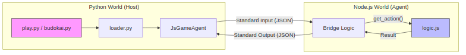
<details>
<summary>Mermaid source</summary>

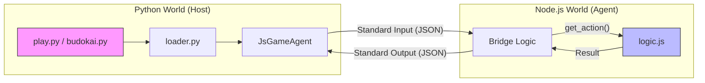
</details>

> **💡 コラム: ポリグロット (Polyglot) とは？**
> 「複数の言語を話す」という意味です。一般には、単一のシステムで複数のプログラミング言語を組み合わせて使う構成を指します。各言語の得意分野(Pythonの豊富なAIライブラリ、JSのWeb表現力等)を活かせるメリットがあります。

---

## 🚀 エージェントのロードと初期化

エージェントがどのようにロードされるか、そのシーケンスを見てみましょう。

`loader.py` は、指定されたディレクトリに `logic.py` があれば Python 版を、 `logic.js` があれば JavaScript 版(`JsGameAgent`)を自動的に選択します。

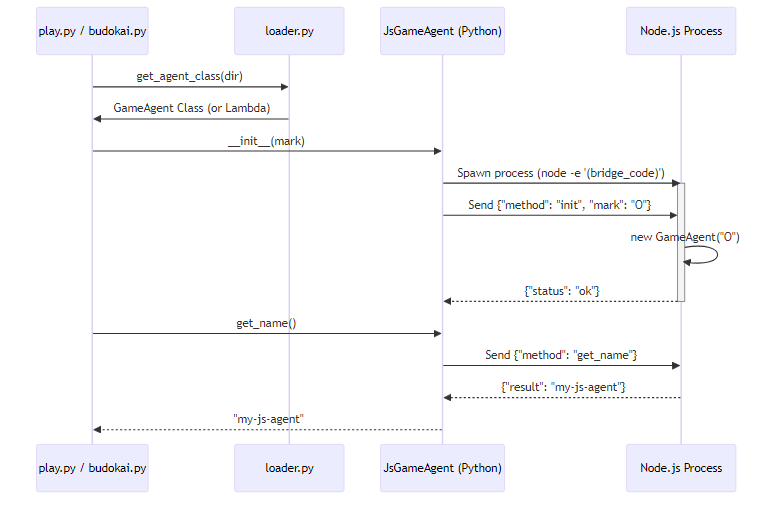
<details>
<summary>Mermaid source</summary>

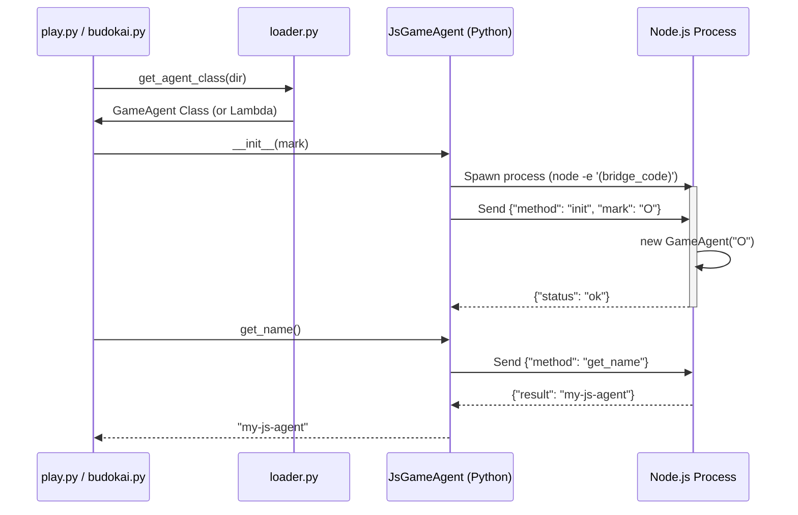
</details>

### 🌉 ブリッジ・コードの工夫
`JsGameAgent` は Node.js プロセスを立ち上げる際、 `-e` オプションを使用して**インラインで JavaScript の待受用コード(ブリッジ・コード)を流し込んでいます**。これにより、別途JavaScriptファイルを用意することなく、動的に Python からJavaScriptの世界を繋ぐことができます。

---

## 🧠 思考(get_action)のやり取り

ゲーム中、次の手を選ぶ際のやり取りは「JSON-RPC」のような形式で行われます。

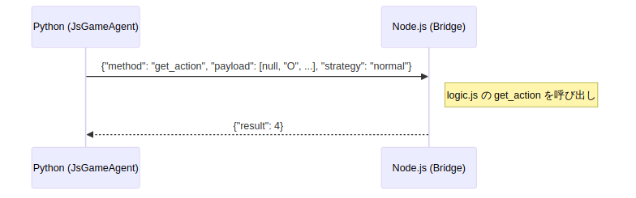
<details>
<summary>Mermaid source</summary>

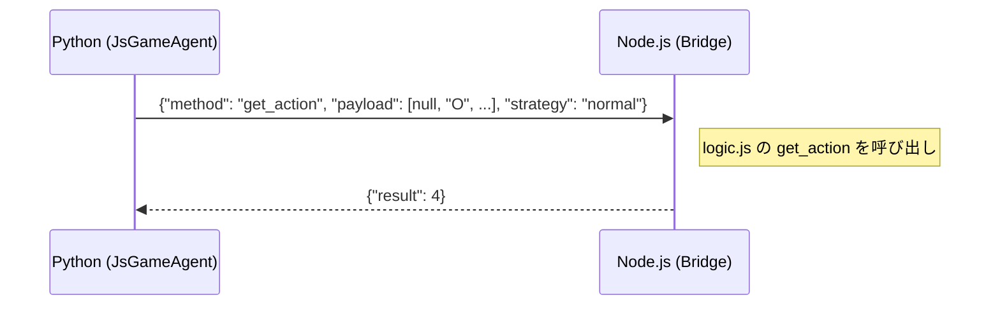
</details>

### 🛠️ データの通り道: 標準入出力
Python と Node.js の間では、以下のルートでデータが流れます。
1. **Python `stdin.write()`** -> Node.js の標準入力へ
2. **Node.js `console.log()`** -> Python の `stdout.readline()` へ

> **💡 コラム: JSON-RPC とは？**
> JSON形式を使って、別の場所(プロセスやサーバー)にある関数を呼び出すためのシンプルな規約です。「どの関数を(method)」「どんな引数で(params/payload)」呼び出すかを送ります。

---

## ⚠️ 異常系とエラーハンドリング

もし `logic.js` の中でエラー(例外)が発生したり、Node.js プロセスがクラッシュしたりした場合の振る舞いです。

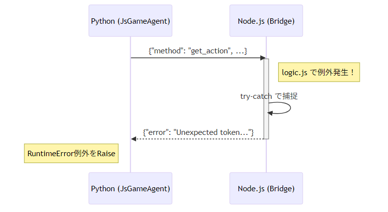
<details>
<summary>Mermaid source</summary>

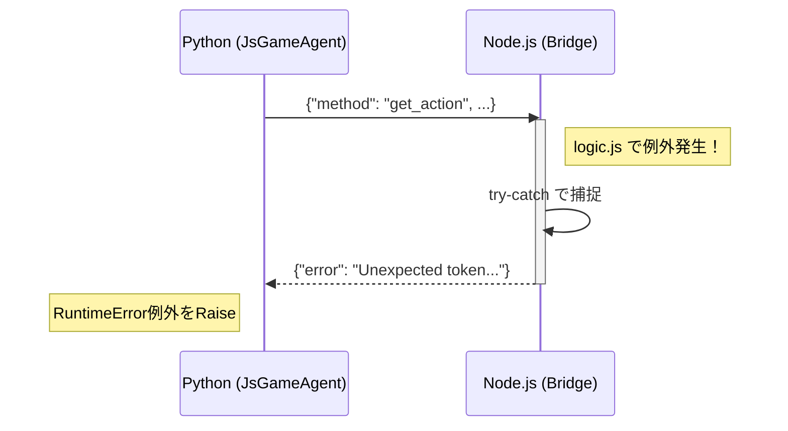
</details>

### プロセスの死活監視
`JsGameAgent` は、Node.js プロセスにデータを送る前に必ずプロセスの状態をチェックしています。
- プロセスが予期せず終了していた場合(`poll()` が None でない場合)、 `RuntimeError` を発生させます。
- 読み取り時にデータが空だった場合も、 `stderr`(標準エラー出力)からエラー内容を読み取って報告します。

---

## 📦 やり取りされるデータの詳細仕様

詳細な設計の参考に、やり取りされる JSON の構造を記します。

### 1. 初期化 (`init`)
- **送信**: `{ "method": "init", "mark": "O" | "X" }`
- **返信**: `{ "status": "ok" }`

### 2. 名前取得 (`get_name`)
- **送信**: `{ "method": "get_name" }`
- **返信**: `{ "result": "エージェント名" }`

### 3. 行動取得 (`get_action`)
- **送信**:
  ```json
  {
    "method": "get_action",
    "payload": [null, "O", "X", null, ...],
    "strategy": "normal" | "original"
  }
  ```
- **返信**: `{ "result": 0 }` (マスのインデックス)

---

## 💻 クロスプラットフォームへの配慮

Windows と Linux/macOS の両方で動作させるために、以下の工夫を凝らしています。

1. **実行ファイルの探索**: `shutil.which('node')` を使い、OSごとの `node` または `node.exe` の場所を自動で見つけます。
2. **パスのエスケープ**: `json.dumps()` を使ってパスを文字列化することで、Windows のバックスラッシュ (`\`) がJavaScriptの文字列内で正しく扱われるようにしています。
3. **文字コード**: `encoding='utf-8'` を明示し、日本語(エージェント名など)が文字化けしないようにしています。
4. **プロセスのクリーンアップ**: Python 側の `__del__`(デストラクタ)で、Node.js プロセスを確実に終了させるようにしています。

---

## 🛠️ pre-commit による多言語環境の自動構築

本プロジェクトでは、開発者が自身のマシンに Node.js や特定のライブラリを手動でインストールしていなくても、テストやツールを実行できる仕組みとして `pre-commit` を活用しています。

ここでは、`pre-commit` がどのようにして Python と JavaScript の仮想環境を使い分け、依存関係を解決しているのかを解説します。

### 🏗️ 環境の分離とキャッシュ
`pre-commit` は、フックの実行に必要な環境をホスト環境(あなたのPCのグローバルな環境)から完全に切り離し、専用のキャッシュディレクトリ(通常は `~/.cache/pre-commit`)に構築します。

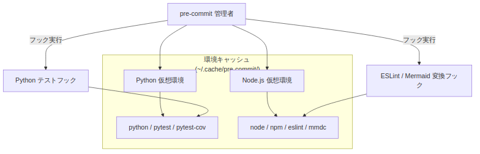
<details>
<summary>Mermaid source</summary>

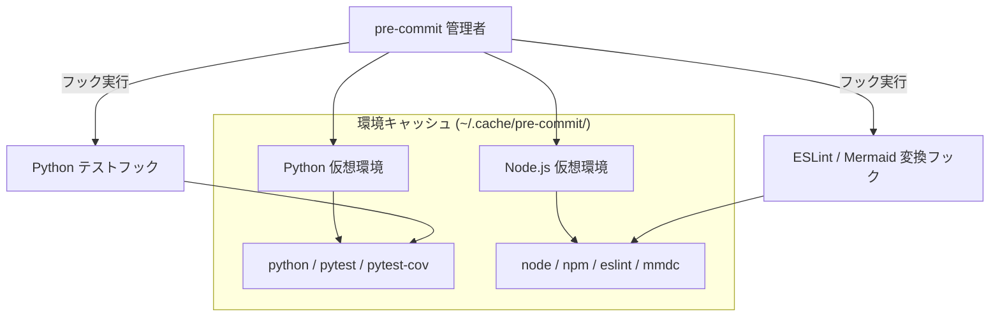
</details>

> **💡 コラム: 仮想環境の正体**
> `pre-commit` は、Python の場合は `virtualenv`、Node.js の場合は `nodeenv` というツールを使用して、最小限のバイナリとライブラリを含む独立したフォルダを作成します。実行時には、このフォルダ内の `bin`(または `Scripts`)ディレクトリを一時的に `PATH` 環境変数の先頭に追加することで、正しいバージョンのツールが優先的に呼び出されるようにしています。

### 🔄 フック実行のライフサイクル(例: ESLint の場合)

ESLint や Mermaid 変換ツールがどのように呼び出されるか、その裏側を見てみましょう。

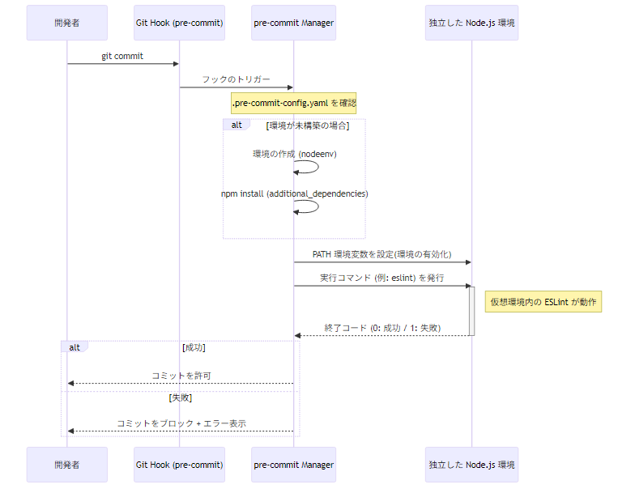
<details>
<summary>Mermaid source</summary>

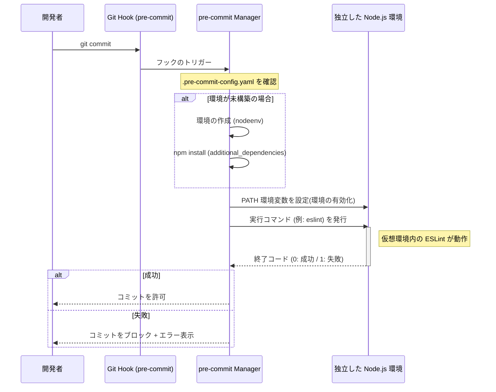
</details>

### 🔍 なぜ「インストール不要」で動くのか？

`additional_dependencies` に記述されたパッケージ(例: `@mermaid-js/mermaid-cli`)は、`pre-commit` がそのフック専用の仮想環境内に自動的に `npm install` します。

そのため：
1. **ホスト汚染がない**: あなたの PC のグローバルな `node_modules` を汚しません。
2. **バージョン固定**: `package.json` がなくても、`.pre-commit-config.yaml` に書かれたバージョンが確実に使われます。
3. **パス解決の自動化**: `pre-commit` が仮想環境内の `node_modules/.bin` を自動的に探索するため、開発者はフルパスを意識することなくコマンド名だけでツールを呼び出せます。

---

## 🔐 閉じたネットワーク(オンプレミス)での活用

もしあなたが「npmjs.com には公開されていない内製の ESLint プラグイン」などを、社内のオンプレミスなリポジトリやローカル環境から取得して使いたい場合も、`pre-commit` は柔軟に対応できます。

### 1. ローカルパスの指定
`additional_dependencies` には、パッケージ名だけでなくローカルのファイルパス(`file:./libs/my-plugin` など)を指定することも可能です。`pre-commit` はこれを受けて、`npm install <path>` を実行し、仮想環境内へ取り込みます。

### 2. プライベートレジストリの切り替え
`npm` の取得先(レジストリ)を社内のサーバーに切り替えたい場合は、環境変数 `NPM_CONFIG_REGISTRY` を活用します。`pre-commit` が `npm install` を実行する際、この環境変数が参照されるため、パッケージの取得先が自動的にオンプレミスなサーバーへと切り替わります。

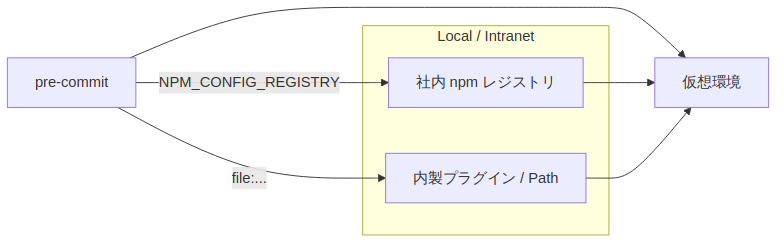
<details>
<summary>Mermaid source</summary>

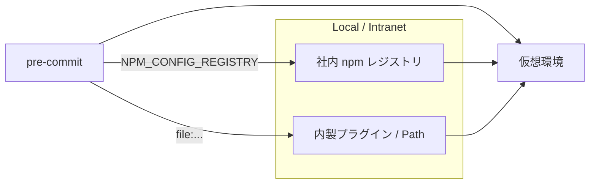
</details>

> **💡 コラム: .npmrc の役割**
> プロジェクトルートに `.npmrc` ファイルを置いて `registry=...` を記述しておく方法もあります。`pre-commit` の仮想環境内であっても、`npm` は実行ディレクトリの `.npmrc` を読み込むため、確実に社内サーバーを見に行くように設定できます。

---

このアーキテクチャのおかげで、私たちは言語の壁だけでなく、環境構築の壁も越えて、安全かつ迅速に開発を進めることができるのです。さあ、あなたも `logic.js` を作って、このポリグロットな世界に飛び込んでみましょう！
